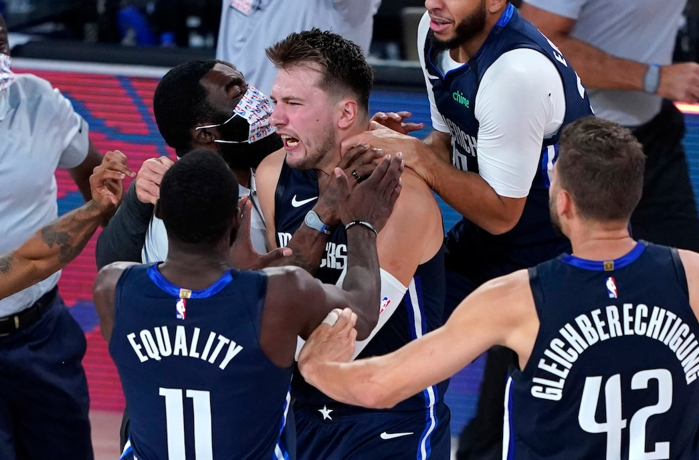

Luka Doncic, on Aug. 23, 2020, against the Clippers is worthy and deserving of your historical consideration: 43 points, 17 rebounds, 13 assists and one cold-blooded dagger straight through the heart of a title contender.

With 3.7 seconds left and the Mavericks needing to inbounds the ball, the most important task was getting it to Doncic. Once that was done, the success rate for Dallas soared immediately.