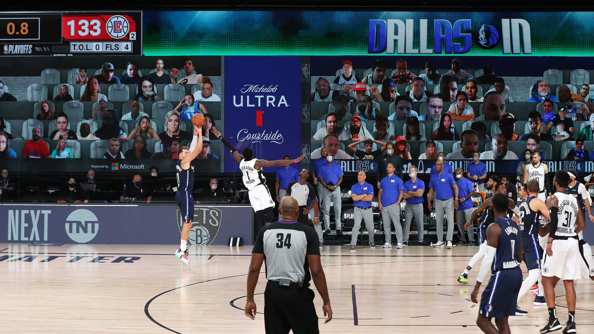

Everyone knew which hands were about to hold their fates. Luka Doncic entered the final possession of Saturday's first-round Game 4 matchup against the Clippers with a 43-point, 17-rebound, 13-assist triple-double.

The inbounds pass hit palms, Doncic found his spot and those hands let fly.

Nothing. But. Net.

Absolute mayhem and an even series in Orlando.

