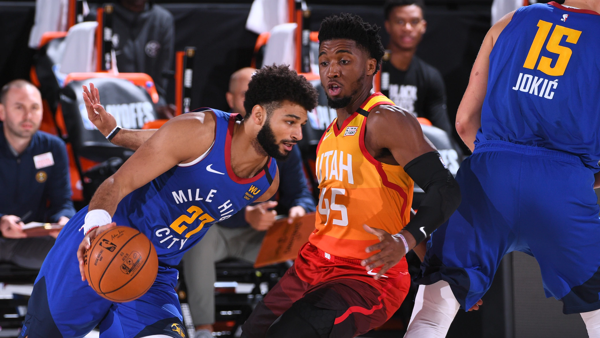

Donovan Mitchell and Jamal Murray battled to the buzzer, and carved out space in the NBA record books.

When Murray's 3-pointer swished to set the final margin in Utah's 129-127 Game 4 victory, it boosted him to 50 points on the night, making this the first game in NBA history that opposing players each reached that threshold.

Mitchell, who had crossed 50 and landed on 51 at the free-throw line seconds earlier, became just the third player in NBA history to score 50 more than once in the same series, joining Michael Jordan (vs. Cleveland, 1988) and Allen Iverson (vs. Toronto, 2001).