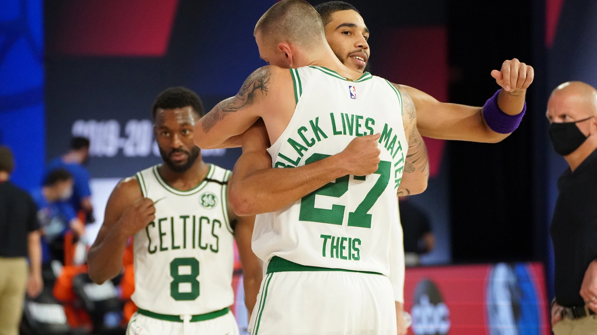

The Boston Celtics completed the first sweep in 15 postseason meetings against the Philadelphia 76ers on Sunday with a 110-106 win to take  the opening round series 4-0.

The Celtics now await the winner of the first-round series between Toronto and Brooklyn for a matchup expected to take place later this week in the Eastern Conference semifinals.

