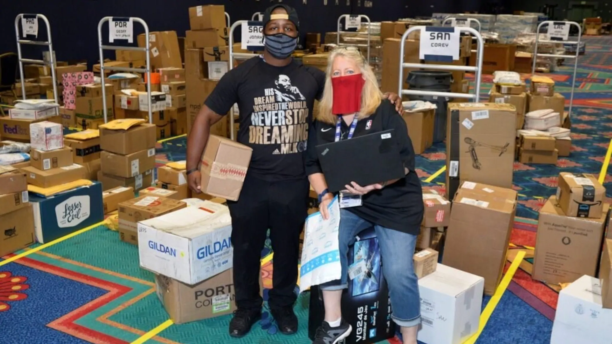
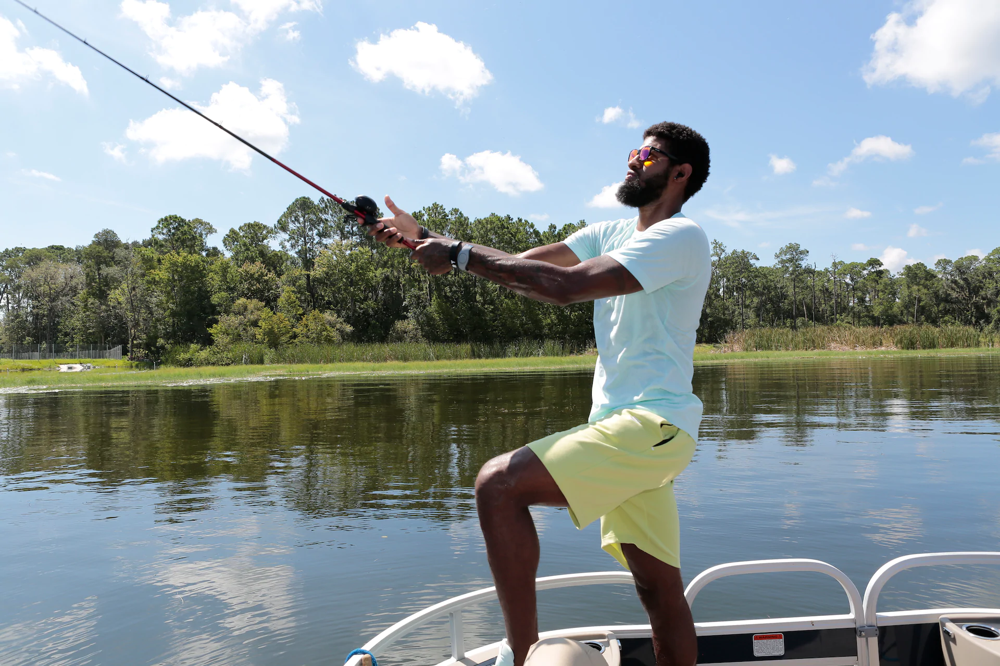

ORLANDO, Fla. -- With these NBA games taking place without fans, there’s this perception of buildings operating at zero capacity, which is not exactly true.

One of the largest sites on the Walt Disney World campus is quite full, especially on Mondays, when the place is packed almost to the rafters. They’re arriving by the truckloads, cramming every available spot, all here to see LeBron James. And Chris Paul. And Jimmy Butler. And Jayson Tatum. And, well, just about everyone on all the playoff rosters.

This is the NBA’s mail and package receiving station, which serves as the initial checkpoint for incoming shipments, and it’s a post office on steroids. With players and coaches and other personnel separated from their families and their typical lifestyles for more than two months now, the demand for care packages is steep.

Many players have had fishing gear delivered in Orlando as they aim to become avid fishermen (like Paul George already is).
